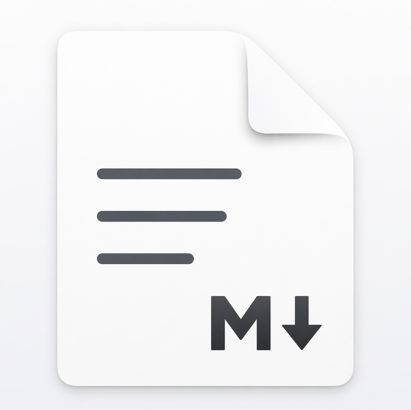

# Notefile

<table>
  <tr>
    <td width="220" valign="top">
      
    </td>
    <td valign="top">
      <p>Notefile is a simple notes app built for organizing quick project thoughts into folders, notes, and timeline-style entries, then keeping them synchronized across Mac, iPhone, and iPad with iCloud.</p>
      <p>Notes are also mirrored to the local filesystem as Markdown files, making them easy to read, back up, edit, or use with project management agents and other developer workflows.</p>
    </td>
  </tr>
</table>

## Highlights

- Large, touch-friendly browser on iPhone with square note and folder tiles
- CloudKit-backed storage with on-device fallback when iCloud is unavailable
- Notes cached locally as entry-per-file note packages and synced through CloudKit records
- macOS mirror that combines note packages back into single `.md` files on disk
- Entry-level search across folders, note titles, and note content
- Autosave while typing, on background, and on navigation away
- Per-note append flow designed for quick capture instead of document-style editing

## Platforms

### iPhone and iPad

- Root screen uses a scrollable 2-column grid of large square tiles
- Home screen has its own hero card so it is visually distinct from folder screens
- Sort the current folder by `A-Z` or `Recent`
- Floating glass `+` button in the lower right expands to `New Folder` and `New Note`
- Floating glass search button sits next to the `+` button on the home screen
- Settings are available from the gear button in the browser header
- Long-press a folder or note to delete it with confirmation
- Search opens a dedicated sheet and can jump directly to a specific matching entry

### macOS

- Uses the same note browser and editor model as iPhone
- Shows a persistent search field beside sort controls
- Search is contextual:
  - `Search notes` at the root searches everything
  - `Search <folder name>` inside a folder scopes results to that folder tree
- Includes Settings for mirror configuration and note preferences
- Supports mirroring CloudKit-backed notes to a user-selected local folder

## Note Editing

- Opening a note takes you directly to the newest entry
- If the latest entry is already blank, Notefile reuses it instead of creating another blank entry
- Optional `New Entry Threshold` setting:
  - if you reopen a note within the configured number of minutes, Notefile resumes the previous entry
  - `0` disables this and always starts a fresh entry when needed
- The newest entry is auto-focused so you can begin typing immediately
- The editor scrolls the active entry toward the top when the note opens
- Previous entries stay editable and can be scrolled back through
- Previous entry editors shrink to fit their content instead of staying full-height
- The active entry card is visually highlighted
- Add a new entry with the centered `+` button below the newest entry
- Delete an entry with the trash icon and confirmation prompt
- Rename notes inline with the pencil button
- Rename folders inline with the same title-and-pencil pattern
- Copy the whole note to the clipboard from the copy icon at the top of the note
- Clipboard export reconstructs the note into one combined text block with dated sections

## Create Flow

- `New Note` and `New Folder` open focused on the name field
- Pressing Return in the name field creates the item immediately when valid
- Emoji is inline inside the name row, right-aligned
- iPhone emoji selection uses the emoji keyboard
- macOS emoji selection opens the system Character Viewer
- New notes and folders auto-select the next unused accent color in the current folder, then cycle once all colors are used

## Search

- Searches:
  - folder names
  - note titles
  - note entry content
- Title and folder-name matches are ranked ahead of content-only matches
- Search results show the whole row as a tappable target
- Entry hits can open the matching note and focus the specific entry

## Settings

- `New Entry Threshold` from `0` to `60` minutes
- `Note Font Size`
- `Note Font`:
  - `System`
  - `Rounded`
  - `Serif`
  - `Monospaced`

macOS-only settings:

- Select the local mirror folder
- Restore the mirror folder automatically with a security-scoped bookmark
- Trigger `Sync Now`
- View current sync status

## Storage Model

Cloud storage:

- CloudKit private database in the `iCloud.com.linquist.notefile` container

Local cache/fallback storage root:

- app support folder named `NotefileCloudKitCache`

Folder storage:

- regular directories
- folder metadata stored in `.notefile-folder.json`

Note storage:

- each note is stored as a `.note` package
- note metadata stored in `.notefile-note.json`
- each entry is stored as its own markdown file inside the package

Example local cache structure:

```text
<cache root>/
  People/
    Kris.note/
      .notefile-note.json
      20260423T153012123Z-<entry-id>.md
      20260424T081455902Z-<entry-id>.md
```

The macOS mirror reconstructs the same note as a single markdown file:

```text
<mirror root>/
  People/
    Kris.md
```

## Sync Behavior

### CloudKit app storage

- When iCloud is available, Notefile syncs notes through CloudKit and keeps a local cache for fast editing
- When iCloud is unavailable, Notefile falls back to local storage and surfaces a warning in the note editor
- Browser refreshes reload content from storage
- Open notes refresh from disk when appropriate without overwriting unsaved local edits

### macOS mirror sync

- Mirrors folders in both directions
- Mirrors notes in both directions
- Exports cloud note packages to combined local `.md` files
- Imports local `.md` edits back into cloud note packages
- Propagates deletes in both directions using the last synced manifest
- Uses simple last-modified-wins behavior with a small timestamp buffer
- Runs periodic background sync on macOS and also supports manual sync

## Metadata

Note metadata currently includes:

- emoji
- accent color

Folder metadata currently includes:

- emoji
- accent color

## Project Layout

- `Notefile.xcodeproj` — Xcode project
- `Notefile/App` — app entry point
- `Notefile/Models` — shared models and preferences
- `Notefile/Services` — repository, markdown codec, and macOS mirror sync
- `Notefile/Views` — browser, creation sheet, note editor, and settings UI
- `scripts/set-version.sh` — updates `MARKETING_VERSION` and optionally `CURRENT_PROJECT_VERSION`
- `scripts/build-macos-dmg.sh` — builds a macOS release app and packages it into a DMG
- `scripts/release-github.sh` — tags the current commit and publishes the DMG to GitHub Releases
- `image.png` — source image used for the app icon and README branding

## Release Flow

Set a new marketing version and optional build number:

```sh
./scripts/set-version.sh 1.1 2
```

Build a local macOS DMG:

```sh
./scripts/build-macos-dmg.sh
```

That writes the DMG to:

```text
dist/Notefile-<version>-macOS.dmg
```

Publish a GitHub release for the current commit:

```sh
./scripts/release-github.sh
```

Or publish a specific version tag:

```sh
./scripts/release-github.sh 1.1
```

Notes:

- Local builds default to unsigned DMGs
- Signed distribution builds:

```sh
SIGN_FOR_DISTRIBUTION=1 ./scripts/build-macos-dmg.sh
```

- Signed and notarized DMGs:

```sh
SIGN_FOR_DISTRIBUTION=1 \
NOTARIZE_DMG=1 \
NOTARYTOOL_KEYCHAIN_PROFILE=notefile-notary \
./scripts/build-macos-dmg.sh
```

- Store notarization credentials in your keychain once with:

```sh
xcrun notarytool store-credentials notefile-notary \
  --apple-id "<apple-id>" \
  --team-id "<team-id>"
```

- `build-macos-dmg.sh` uses the project’s configured Developer Team by default
- `release-github.sh` requires a clean git working tree
- `release-github.sh` defaults to signed and notarized release builds
- `release-github.sh` uses the `gh` CLI to create or update the GitHub release

## Current Tradeoffs

- Complex multi-device conflict resolution is intentionally not implemented
- Sync behavior uses pragmatic last-modified decisions instead of merge-heavy logic
- Folder metadata remains JSON because folders do not have their own markdown body

## Verification

Verified locally:

- `xcodebuild -project Notefile.xcodeproj -scheme Notefile -destination 'generic/platform=macOS' -derivedDataPath /Users/kris/code/notefile/.derived-macos build CODE_SIGNING_ALLOWED=NO`

Result:

- macOS build succeeds in this environment

Known environment limitation:

- full iPhone simulator asset compilation cannot be completed here because `actool` has no simulator runtimes available in this environment
